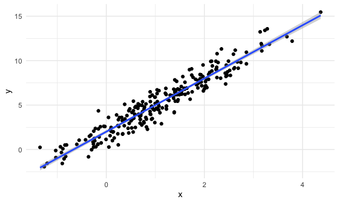
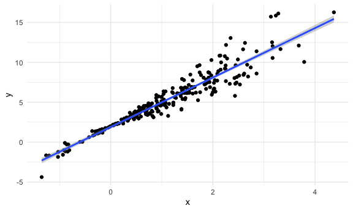
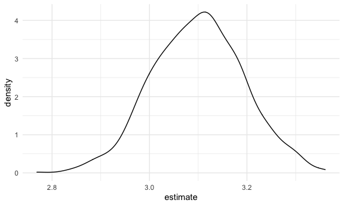

Linear models
================

``` r
library(tidyverse)
```

    ## ── Attaching packages ──────────────────────────────────────────── tidyverse 1.3.0 ──

    ## ✓ ggplot2 3.3.2     ✓ purrr   0.3.4
    ## ✓ tibble  3.0.3     ✓ dplyr   1.0.2
    ## ✓ tidyr   1.1.2     ✓ stringr 1.4.0
    ## ✓ readr   1.3.1     ✓ forcats 0.5.0

    ## ── Conflicts ─────────────────────────────────────────────── tidyverse_conflicts() ──
    ## x dplyr::filter() masks stats::filter()
    ## x dplyr::lag()    masks stats::lag()

``` r
library(modelr)
library(p8105.datasets)

knitr::opts_chunk$set(
  fig.width = 6,
  fig.asp = .6,
  out.width = "90%"
)
theme_set(theme_minimal() +  theme(legend.position = "bottom"))

options(
  ggplots2.continuous.color = "viridis",
  ggplots2.continuous.fill = "viridus"
)

scale_colour_discrete = scale_colour_viridis_d
scale_fill_discrete = scale_fill_viridis_d
```

## Simulate data

``` r
n_samp = 250

sim_df_const = 
  tibble(
    x = rnorm(n_samp, 1, 1),
    error = rnorm(n_samp, 0, 1),
    y = 2 + 3 * x + error
  )

sim_df_nonconst = sim_df_const %>% 
  mutate(
  error = error * .75 * x,
  y = 2 + 3 * x + error
)
```

Plot the datasets

``` r
sim_df_const %>% 
  ggplot(aes(x = x, y= y)) +
  geom_point() +
  geom_smooth(method = "lm")
```

    ## `geom_smooth()` using formula 'y ~ x'



``` r
sim_df_nonconst %>% 
  ggplot(aes(x = x, y= y)) +
  geom_point() +
  geom_smooth(method = "lm")
```

    ## `geom_smooth()` using formula 'y ~ x'



``` r
lm(y ~ x, data = sim_df_const) %>% broom::tidy()
```

    ## # A tibble: 2 x 5
    ##   term        estimate std.error statistic   p.value
    ##   <chr>          <dbl>     <dbl>     <dbl>     <dbl>
    ## 1 (Intercept)     2.01    0.0881      22.8 9.65e- 63
    ## 2 x               2.99    0.0587      51.0 1.54e-133

``` r
lm(y ~ x, data = sim_df_nonconst) %>% broom::tidy()
```

    ## # A tibble: 2 x 5
    ##   term        estimate std.error statistic   p.value
    ##   <chr>          <dbl>     <dbl>     <dbl>     <dbl>
    ## 1 (Intercept)     1.89    0.0982      19.2 5.04e- 51
    ## 2 x               3.10    0.0654      47.4 3.04e-126

## Draw one bootstrap sample

``` r
boot_sample = function(df){
  sample_frac(df, replace = TRUE) %>% #draw a sample of a particular proportion of dataset
    arrange(x)
}
```

Check if this works ..

``` r
boot_sample(sim_df_nonconst) %>%  #把 sim_df_nonconst 代入function中的df
    ggplot(aes(x = x, y= y)) +
  geom_point(alpha = 0.3) +
  geom_smooth(method = "lm") +
  ylim(-5, 16)
```

    ## `geom_smooth()` using formula 'y ~ x'

    ## Warning: Removed 1 rows containing non-finite values (stat_smooth).

    ## Warning: Removed 1 rows containing missing values (geom_point).


``` r
boot_sample(sim_df_nonconst) %>% 
  lm(y ~ x, data = .) %>% 
  broom::tidy()
```

    ## # A tibble: 2 x 5
    ##   term        estimate std.error statistic   p.value
    ##   <chr>          <dbl>     <dbl>     <dbl>     <dbl>
    ## 1 (Intercept)     2.01    0.0843      23.8 5.96e- 66
    ## 2 x               3.01    0.0564      53.3 7.49e-138

## Many samples and analysis

``` r
boot_straps = 
  tibble(
    strap_number = 1:1000,
    strap_sample = rerun(1000, boot_sample(sim_df_nonconst))
  )
```

Can I run my analysis on these…?

``` r
boot_results = 
  boot_straps %>% 
  mutate(
    models = map(.x = strap_sample, ~lm(y ~ x, data = .x)),
    results = map(models, broom::tidy)
  ) %>% 
  select(strap_number, results) %>% 
  unnest(results)
```

What do I have now?

``` r
boot_results %>% 
  group_by(term) %>% 
    summarize(
      mean_est = mean(estimate),
      sd_est = sd(estimate)
    )
```

    ## `summarise()` ungrouping output (override with `.groups` argument)

    ## # A tibble: 2 x 3
    ##   term        mean_est sd_est
    ##   <chr>          <dbl>  <dbl>
    ## 1 (Intercept)     1.89 0.0685
    ## 2 x               3.10 0.0931

Look at the distributions

``` r
boot_results %>% 
  filter(term == "x") %>% 
  ggplot(aes(x = estimate)) +
  geom_density()
```



Construct bootstrap CI

``` r
boot_results %>% 
  group_by(term) %>% 
  summarize(
    ci_lower = quantile(estimate, 0.025),
    ci_upper = quantile(estimate, 0.975)
  )
```

    ## `summarise()` ungrouping output (override with `.groups` argument)

    ## # A tibble: 2 x 3
    ##   term        ci_lower ci_upper
    ##   <chr>          <dbl>    <dbl>
    ## 1 (Intercept)     1.76     2.03
    ## 2 x               2.92     3.29

## Bootstrap using modelr

Can I simplify anything ..? YES

``` r
sim_df_nonconst %>% #change the datasets also works for the same codes
  bootstrap(1000, id = "strap_number") %>% 
    mutate(
    models = map(.x = strap, ~lm(y ~ x, data = .x)),
    results = map(models, broom::tidy)
  ) %>% 
  select(strap_number, results) %>% 
  unnest(results) %>% 
  group_by(term) %>% 
    summarize(
      mean_est = mean(estimate),
      sd_est = sd(estimate)
    )
```

    ## `summarise()` ungrouping output (override with `.groups` argument)

    ## # A tibble: 2 x 3
    ##   term        mean_est sd_est
    ##   <chr>          <dbl>  <dbl>
    ## 1 (Intercept)     1.89 0.0649
    ## 2 x               3.10 0.0919

## Revisit nyc airbnb

``` r
data("nyc_airbnb")

nyc_airbnb = 
  nyc_airbnb %>% 
  mutate(stars = review_scores_location / 2) %>% 
  rename(
    borough = neighbourhood_group,
    neighborhood = neighbourhood) %>% 
  filter(borough != "Staten Island") %>% 
  select(price, stars, borough, neighborhood, room_type)
```

``` r
nyc_airbnb %>% 
  ggplot(aes(x = stars, y =price)) +
  geom_point()
```

    ## Warning: Removed 9962 rows containing missing values (geom_point).


``` r
airbnb_boot_results =
nyc_airbnb %>% 
  filter(borough == "Manhattan") %>% 
  drop_na(stars)%>% 
  bootstrap(1000, id = "strap_number") %>% 
    mutate(
    models = map(.x = strap, ~lm(price ~ stars, data = .x)),
    results = map(models, broom::tidy)
  ) %>% 
  select(strap_number, results) %>% 
  unnest(results)

airbnb_boot_results %>% 
  group_by(term) %>% 
    summarize(
      mean_est = mean(estimate),
      sd_est = sd(estimate)
    )
```

    ## `summarise()` ungrouping output (override with `.groups` argument)

    ## # A tibble: 2 x 3
    ##   term        mean_est sd_est
    ##   <chr>          <dbl>  <dbl>
    ## 1 (Intercept)    -33.7  33.2 
    ## 2 stars           43.2   6.75

Compare this to `lm`

``` r
nyc_airbnb %>% 
  filter(borough == "Manhattan") %>% 
  drop_na(stars)%>% 
  lm(price ~ stars, data = .) %>%  #with this dataset
  broom::tidy()
```

    ## # A tibble: 2 x 5
    ##   term        estimate std.error statistic  p.value
    ##   <chr>          <dbl>     <dbl>     <dbl>    <dbl>
    ## 1 (Intercept)    -34.3     22.9      -1.50 1.35e- 1
    ## 2 stars           43.3      4.78      9.07 1.39e-19

``` r
airbnb_boot_results %>% 
  filter(term == "stars") %>% 
  ggplot(aes(x = estimate)) +
  geom_density()
```


